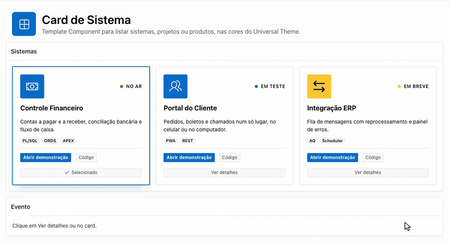

# Card de Sistema para Oracle APEX


<p align="justify">Template Component para listar sistemas, projetos ou produtos em cards: ícone, selo de status, título com link, frase, tags, até dois botões e uma seleção opcional, em grade ou em carrossel. A aparência vem das variáveis do Universal Theme, então o card acompanha o theme style, claro ou escuro, sem CSS do app.</p>

<p align="center">
  
</p>

## O que faz

- Monta os cards a partir de uma consulta SQL: uma linha, um card. Em grade, eles quebram em linhas e se ajustam à largura da região; em carrossel, formam uma faixa que rola para o lado, com encaixe por card e setas que só aparecem quando há mais cards do que cabem e param no último.
- Selo de status com ponto na cor do estado e ícone na cor do token escolhido, os dois lidos das variáveis `--ut-palette-*` do tema.
- Seleção opcional: com o rótulo de seleção preenchido, o card ganha um botão no rodapé. O clique no botão, ou no card fora dos links, marca o card, troca o texto do botão e dispara o evento `cardsistemaselecao` na região.
- Textos com escape de HTML. Cor e estado passam por uma lista fechada: valor fora dela cai no padrão, sem virar classe.
- Links só com `http`, `https` ou endereço relativo. Link com outro esquema (`javascript:`, `data:`) perde o endereço e deixa de ser link.
- Acessibilidade: a grade é uma lista, o leitor de tela lê o rótulo antes do status, o botão de seleção diz o estado no próprio texto e leva o título do card no nome acessível, e a animação de hover respeita `prefers-reduced-motion`.

## Requisitos

<p align="justify">Oracle APEX 26.1 ou superior, num app com o Universal Theme: o card usa os Template Components Avatar e Badge do tema. O instalável foi exportado do APEX 26.1.0 e testado no 26.1.0 e no 26.1.4, com os theme styles Vita, Vita - Dark, Redwood Light e Iris. A 2.2.1 também foi testada no 26.1.5, no Safari do iPhone. App que veio de versão antiga do APEX e não tem esses componentes no tema precisa de <b>Shared Components > Themes > Refresh Theme</b>.</p>

## Instalação

1. No App Builder, abra **Shared Components > Plug-ins** e clique em **Import**.
2. Envie o arquivo `template_component_plugin_br_com_cleitoncruz_card_sistema.sql` e siga o assistente até **Install Plug-in**.

Para atualizar, importe a versão nova no mesmo app: o plug-in é substituído e as regiões continuam ligadas a ele.

## Uso

**1. Crie a região.** No Page Designer, crie uma região do tipo **Card de Sistema** com uma consulta SQL de origem, como esta:

```sql
select s.nome            titulo,
       s.codigo          chave,
       s.resumo          descricao,
       s.icone           icone,        -- ex.: fa-money
       s.cor             cor,          -- primary, success, info, warning, danger ou generic
       s.status          status,
       s.status_cor      status_estado, -- success, info, warning ou danger
       'Status'          rotulo_status,
       s.tags            tags,         -- ex.: PL/SQL|ORDS|PWA
       s.url_detalhe     link_titulo,
       s.url_demo        link_primario,
       'Abrir demonstração' rotulo_primario,
       s.url_codigo      link_secundario,
       'Código'          rotulo_secundario,
       'Ver detalhes'    rotulo_selecao,
       'Selecionado'     rotulo_selecionado,
       case when row_number() over (order by s.ordem) = 1 then 'S' end selecionado
  from sistemas s
 order by s.ordem
```

**2. Ligue cada atributo a uma coluna** em **Region > Attributes**. O Page Designer não faz isso sozinho: em cada atributo, escolha na lista a coluna de mesmo nome da consulta acima. Título e Ícone são obrigatórios.

| Atributo | Obrigatório | Para que serve |
|---|---|---|
| Título | sim | Nome mostrado no card. |
| Link do título | | Endereço do título, na mesma aba. |
| Descrição | | Frase curta abaixo do título. |
| Ícone | sim | Classe do Font APEX sem o `fa ` do começo, como `fa-money`. |
| Cor | | Cor do ícone: `primary`, `success`, `info`, `warning`, `danger` ou `generic`. Outro valor usa `primary`. |
| Status | | Texto do selo no canto do card. Vazio: sem selo. |
| Estado do status | | Cor do selo: `success`, `info`, `warning` ou `danger`. Outro valor deixa o selo neutro. |
| Rótulo do status | | Texto que o leitor de tela lê antes do status, como `Status`. |
| Tags | | Tags separadas por `\|`. |
| Link principal, Rótulo do link principal | | Botão principal, aberto em nova aba. |
| Link secundário, Rótulo do link secundário | | Segundo botão, aberto em nova aba. Sem nenhum dos dois links, a faixa de botões some. |
| Chave | | Identifica o card no evento de seleção. |
| Rótulo do botão de seleção | | Texto do botão que seleciona o card. Vazio: o card não tem seleção. |
| Rótulo do botão selecionado | | Texto do botão no card selecionado. Vazio: repete o rótulo de seleção. |
| Selecionado | | Marca o card como selecionado ao carregar. Vazio, `N`, `F`, `0` e `false` contam como não. |

**3. Escolha o layout**, também em **Region > Attributes**. Estes três valem para a região inteira, não saem de coluna:

| Atributo | Padrão | Para que serve |
|---|---|---|
| Layout | Grade | Grade: os cards quebram em linhas. Carrossel: uma faixa que rola para o lado, três cards por vez (dois em tela média e um no celular, com a ponta do próximo aparecendo). |
| Rótulo da seta anterior | Anterior | Nome que o leitor de tela lê na seta que volta. Aceita `&APP_TEXT$NOME_DA_MENSAGEM.`, com a text message marcada **Used in JavaScript**: a região é redesenhada no navegador e o rótulo é resolvido lá. O atributo também é traduzível pelo repositório de tradução do app. |
| Rótulo da seta próxima | Próximo | Nome que o leitor de tela lê na seta que avança. Mesmas regras. |

<p align="justify">O componente também aparece como <b>Single</b>, para mostrar um card só, fora da grade; a seleção funciona igual.</p>

### Evento de seleção

<p align="justify">A seleção vale dentro da mesma região e dispara <code>cardsistemaselecao</code> no elemento da região, com a chave do card e se o clique foi no botão. Numa Dynamic Action: evento <b>Custom</b>, Custom Event <code>cardsistemaselecao</code>, Selection Type <b>Region</b>; os dados chegam em <code>this.data</code>.</p>

```js
apex.jQuery("#sistemas").on("cardsistemaselecao", function (evento, dados) {
  // dados = { chave: "portal", peloBotao: true }
  apex.item("P1_SISTEMA").setValue(dados.chave);
});
```

### Aparência

<p align="justify">As classes começam com <code>pf-</code>: <code>pf-Card</code> nos cards e na grade, <code>pf-Carrossel</code> na navegação do carrossel. As regras usam só classes, sem id nem <code>!important</code>: a maioria tem uma classe, e hover e seleção têm duas. Para sobrescrever qualquer uma, prefixe com o Static ID da região, como no exemplo. A largura mínima de cada coluna da grade fica em <code>--pf-card-min</code> (17rem), o espaço entre os cards em <code>--pf-card-gap</code> (1rem) e quantos cards o carrossel mostra por vez, acima do celular, em <code>--pf-carrossel-visiveis</code> (no celular é sempre um, com a ponta do próximo aparecendo); as setas usam <code>pf-Carrossel-nav</code> e <code>pf-Carrossel-seta</code>. A superfície, a borda, o texto e a sombra vêm de <code>--ut-component-*</code> e <code>--ut-shadow-*</code>.</p>

```css
#sistemas .pf-CardGrid { --pf-card-min: 22rem; }
#sistemas .pf-CardGrid--carrossel { --pf-carrossel-visiveis: 2; }
#sistemas .pf-Card.is-selecionado {
  border-color: var(--ut-palette-success);
  box-shadow: 0 0 0 1px var(--ut-palette-success), var(--ut-shadow-md);
}
```

## Arquivos

| Arquivo | O que é |
|---|---|
| `template_component_plugin_br_com_cleitoncruz_card_sistema.sql` | Instalável, exportado do APEX. |
| `card-sistema.css`, `card-sistema.js` | Arquivos do plug-in, os mesmos que vão dentro do instalável. |
| `partial.html`, `report-body.html`, `report-row.html` | Templates do componente, também dentro do instalável. |

## Autor

Cleiton Cruz, desenvolvedor Oracle APEX e PL/SQL.
[linkedin.com/in/cleitonrcruz](https://www.linkedin.com/in/cleitonrcruz/)

## Licença

MIT. Veja [LICENSE](LICENSE).
